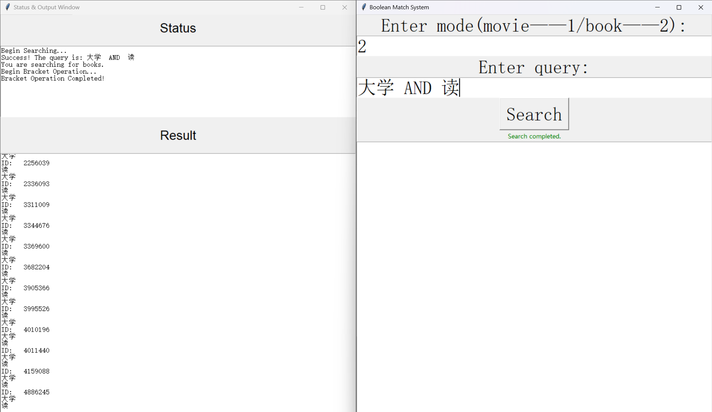

# <center>Web信息处理与应用 实验一</center>


## 实验简介

​	结合给定的电影，书籍的标签信息，实现对电影和书籍的检索，结合用户评价信息及用户间的社交关系，进行个性化电影和书籍推荐

### 实验环境

+ System：Win 11
+ 开发工具：Vscode，Pycharm community
+ 编程语言：python
+ 编程环境：Anaconda

+ Repository：[Github仓库](https://github.com/Mamya22/WebInfo.git)

### 实验成员

+ 组长：方馨     PB22111656
+ 组员：马筱雅 PB22111639
+ 组员：陈昕琪 PB22111711
### 代码目录
```
├─report
│  │  report.md
│  │  report.pdf		//实验报告
│  └─assets
├─stage1
│  │  book_split.py		//book分词
│  │  compress.py		//压缩
│  │  create_dict.py	//创建倒排表和跳表
│  │  movie_split.py	//movie分词
│  │  README.md		
|  |  search_without_skip.py  //不带跳表的布尔索引
│  │  search.py			//布尔索引
│  │  split_word.py		//分词
│  │  tempCodeRunnerFile.py
│  ├─dataset			//基础数据
│  ├─result
│  │      block_compressed.json
│  │      book_block_compressed.json		//book按块压缩
│  │      book_compressed_revert_dict.bin	//book可变长度编码压缩
│  │      book_keyword.json					
│  │      book_keyword_zip.json				//book分词结果
│  │      book_reverted_dict.json			//book倒排表
│  │      book_skip_dict.json				//book跳表
│  │      movie_block_compressed.json		//movie按块压缩
│  │      movie_compressed_revert_dict.bin	//movie可变长度编码压缩
│  │      movie_keyword.json		
│  │      movie_keyword_zip.json			//movie分词结果
│  │      movie_reverted_dict.json			//movie倒排表
│  │      movie_skip_dict.json				//movie跳表
└─stage2
    │  data_process.py   // 处理数据的函数，包括时间编码，向量生成等
    │  index_mapping.py  // 数据集文件
    │  Model.py          // BiasSVD模型
    │  preprocess.py     // 预处理文件，调用data_process中的函数
    │  train.py           //训练文件
    │
    └─dataset
            book_score.csv
            book_tag_embedding_dict.pkl  // book Tag编码
            movie_score.csv
            selected_book_top_1200_data_tag.csv
            selected_movie_top_1200_data_tag.csv
            tag_embedding_dict.pkl
```
## 实验内容

### 第一阶段 豆瓣数据的索引

#### 1. 对数据进行预处理

+ 两种分词方法说明，使用`jieba`和`SnowNLP`两种分词工具。  
  + `jieba`：支持三种分词模式：
  精确模式，试图将句子最精确地切开，适合文本分析；
  全模式，全是一种比较宽松的分词模式，它会将文本中所有可能的词语都分出来，速度非常快，但是不能解决歧义（不考虑这种模式）；
  搜索引擎模式，在精确模式的基础上，对长词再次切分，提高召回率，适合用于搜索引擎分词。
  + `SnowNLP`：一个用python写的类库，可用于中文分词，词性标注，情感分析等。
  
+ 两种分词方法比较：
  + 在去除停用词的情况下，直观比较分词文件结果大小可以发现用`jieba`的精确模式文件大小为`4546kb`，`jieba`的搜索引擎模式文件大小为`5269kb`，`SnowNLP`文件大小为`5090kb`。  
  + 进一步对比发现，`SnowNLP`倾向于把词分的更短更细致，比如对于“不象话”这个词，`SnowNLP`把它分成了"不象"和"话"两个词。而`jieba`的精确模式倾向于将词语精确地切开，分的是“不象话”这个完整的词。`jieba`的搜索引擎模式则会保留多种分割结果，分的是“不象”“象话”和“不象话”三个词。还有`jieba`的精确模式分词“村上春树”，`jieba`的搜索引擎模式分为“村上”和“村上春树”，而`SnowNLP`分词“村”“上”“春”“树”等等，这样的例子还有很多。在这个布尔检索项目中，`jieba`的搜索引擎模式一方面对于不确定的词语保留了分词的多种可能，对比精简模式有更高的召回率，又不像`SnowNLP`，把词语分的过于琐碎，有些词语失去了完整性。我认为`jieba`的搜索引擎模式分词召回率更高且词语更为完整。因此选择`jieba`的搜索引擎模式完成接下来的实验部分。但是值得注意的是，在后续合并近义词时，多种分词结果可能会被当做近义词合并，将相似度设置为较高的0.9可以避免一部分这种情况，但仍值得思考。
  
+ 去除停用词
  + 选用哈工大停用词表，去除词项中的停用词。
  
  + 以下为文件大小对比
  
    | 文件内容                               | 文件大小 |
    | -------------------------------------- | -------- |
    | 不做处理的分词的未压缩的书籍倒排索引表 | 4296kb   |
    | 压缩后的书籍倒排索引表                 | 487kb    |
    | 不做处理的分词的未压缩的电影倒排索引表 | 14176kb  |
    | 压缩后的电影倒排索引表                 | 1385kb   |
    | 去除停用词后的未压缩的书籍倒排索引表   | 4012kb   |
    | 压缩后的书籍倒排索引表                 | 454kb    |
    | 去除停用词后的未压缩的电影倒排索引表   | 13458kb  |
    | 压缩后的电影倒排索引表                 | 1316kb   |
  
  
  **由此，去除停用词使压缩后的倒排索引表文件大小减小为95%左右。**
  
+ 合并近义词
  
  核心代码如下：

  ```python
  for i in range(len(extracted_word)):
      if extracted_word[i] not in self.single_id_info and extracted_word[i] != ' ':#不在列表中的词加入
          flag = 0
          embeddings1 = model.encode(extracted_word[i])
          for j in range(l):#若和列表中的词词意相近则删除，否则加入
              embeddings2 = self.embeddings[j]
              if model.similarity(embeddings1,embeddings2).item() > 0.9:
                  flag = 1
                  break
          if flag == 0:
              self.single_id_info.append(extracted_word[i])
              self.embeddings.append(embeddings1)
              l += 1
  ```

  + 使用`sentence_transformers`库分析两个词语的相似度，遍历某本书或某个电影的所有词项，相似度高于0.9的合并。
  + 去除停用词且合并近义词后的未压缩的书籍倒排索引表文件大小`2656kb`，压缩后的书籍倒排索引表文件大小`339kb`，去除停用词后且合并近义词的未压缩的电影倒排索引表文件大小`8331kb`，压缩后的电影倒排索引表文件大小`927kb`。去除停用词且合并近义词对比仅去除停用词，使压缩后的倒排索引表文件大小减小为70%左右，提升效果显著。

#### 2. 建立倒排索引表和跳表指针

+ 倒排表的建立

  遍历预处理生成的`keyword`数据集，如果是新的词项则创建列表，如果已经存在，则将其按照`ID`升序的顺序插入到对应的倒排表中

  核心代码如下：

  ```python
  for key, items in self.dict.items():
      for item in items:
          key_value = int(key)
          if key_value not inself.reverted_dict[item]:
               bisect.insort(self.reverted_dict[item], key_value) # 按照顺序插入
  ```

+ 跳表指针的生成

  对于已经实现的倒排索引表，遍历所有的关键词，为每个关键词生成跳表，根据其倒排表的长度计算跳表的间隔并生成跳表节点。

  **这里用$\sqrt{L}$作为跳表间隔，其中L为倒排表长度**

  核心代码如下：
  
  ```python
  def _create_skip_list(self, keyword): 
          length = len(self.reverted_dict[keyword])
          self.length[keyword] = length # 记录倒排表长度 
          # 取跳表间隔为关键词长度的平方根
          length_sqrt = int(length ** 0.5)
          self.interval[keyword] = max(1, length_sqrt) # 确保间隔至少为1 
          # 设置头节点
          if self.length[keyword] > 1:
              skip_length = self.interval[keyword]
          else:
              skip_length = 0
          self.list_head[keyword] = ((self.reverted_dict[keyword][0]), skip_length , 0) # 文档ID;跳表间隔；初始索引值
          self.skip_dict[keyword] = [self.list_head[keyword]]
          
          for i in range(self.interval[keyword], self.length[keyword] - self.interval[keyword], self.interval[keyword]):
              # 以跳表间隔为步长，遍历倒排表
              # 元组赋值为对应ID;下一个节点索引值；当前节点索引值   
              node = ((self.reverted_dict[keyword][i]), i + self.interval[keyword], i)
              # 添加到序列
              self.skip_dict[keyword].append(node)
          
          # 当前最后一个节点索引值
          cur_last_index = len(self.skip_dict[keyword])*self.interval[keyword]
          if cur_last_index < len(self.reverted_dict[keyword])-1:
              # 未到最后一个节点
              node = ((self.reverted_dict[keyword][cur_last_index]),len(self.reverted_dict[keyword])-1,cur_last_index)
              # 添加尾节点
              self.skip_dict[keyword].append(node)
  ```
  
+ 输出结果：

  在分词合并实现的`keyword.json`文件的基础上，创建倒排索引表和跳表，输出文件部分截图如下：

  + 倒排索引表

    

    用字典存储倒排表，`tag`作为键值，列表中存储包含该`tag`的`ID`

  + 跳表

    

    跳表中每个节点的结构包含了三个元素，分别是文档ID，下一个节点的索引值和当前节点的索引值。

#### 3. 布尔查询

提高索引速度可以通过对文档ID进行按序排列，借助跳表等方法。在构建倒排表时已经实现了文档ID的升序存储，因此在索引时，我们借用已经实现的倒排表，进行快速索引。

+ 基本操作符

  + AND

    对两个倒排表求交集，首先根据`tag`获取到两个倒排表和对应的跳表。在两个表的开头分别放置指针，如果两个倒排表的当前 ID 相等，则将该 ID 添加到结果列表 `ret` 中，并同时增加两个索引。如果不相等，则增加较小 ID 所在的列表的索引。

    其中跳跃通过循环实现，如果当前节点的 ID 在第一个列表中小于第二个列表中，且跳跃后的 ID 也小于，则跳过多个节点。

  + OR

    对两个倒排表求并集，获取到两个倒排表和对应的跳表。如果两个倒排表的当前 ID 相等，则将该 ID 添加到结果列表 `ret` 中，并同时增加两个索引。如果不相等，则增加较小 ID 所在的列表的索引，并将该 ID 添加到结果列表 `ret` 中。最后对剩余元素进行处理，将元素添加到结果列表中。

  + AND NOT

    > 由长尾效应可知，大部分词项在文档中出现的频率很低，使用`NOT`运算取补集时，可能出现结果集的大小通常接近全集的长度这种情况。在数据集很大的情况下，空间复杂度和时间复杂度都很高，所以为了优化`AND` 后紧跟 `NOT` 的情况，可以通过调整跳表操作来减少空间和时间复杂度。(具体比较见下文)

    从第一个倒排表中移除出现在第二个倒排表中的文档ID，即求差集。如果两个倒排表的当前 ID 相等，则同时增加两个索引。 如果不相等，则增加较小 ID 所在的列表的索引，并将该 ID 添加到结果列表 `ret` 中。最后如果第一个倒排表还有剩余元素，则添加到结果列表中。

  + NOT

    从预先存储的文档ID列表中去掉传入的倒排表中的所有ID，利用AND_NOT方法，即可实现
    
  + **对于处理完的基础操作二元表达式，需要对结果创建新的跳表，用于递归调用，处理复杂语句**

+ 文法输入设计

  输入允许括号，`AND`，`OR`，`NOT`四种运算符，实现的文法如下

  ```python
  <expression> ::= <term> | <expression> "OR" <term>
  <term> ::= <factor> | <term> "AND" <factor> | <term> " AND NOT" <factor>
  <factor> ::= "NOT" <factor> | "(" <expression> ")" | <keyword>
  <keyword> ::= "tag" # 倒排表中的tag
  ```

  其中，`<expression>` 是表达式，可以是一个 `<term>` 或者是 `<expression>` 和 `"OR"` 连接的 `<term>`。

  `<term>` 表示项，可以是一个 `<factor>`、`<term>` 和 `"AND"` 连接的 `<factor>`，或 `<term>` 和 `"AND NOT"` 连接的 `<factor>`。

  `<factor>` 表示因子，可以是 `"NOT"` 连接的 `<factor>`、括号括起来的 `<expression>`，或者是一个 `<keyword>`。

  `<keyword>` 表示关键词，即倒排表中的关键词。

  当输入时，首先对其进行归一化处理，排查括号的中英文是否正确或者大小写中英文，全部转化为英文括号和大写操作符。之后先递归的匹配左括号，找到对应的右括号之后，再递归寻找，直到所有的括号都被拆除后，根据递归顺序匹配字符串，进行操作。最后返回找到的`ID`，然后输出`ID`值。

  为了佐证找到的`ID`是正确的，又不影响输出窗口的简介，仅输出`ID`对应的书籍/电影中出现的表达式中包含的`tag`。

+ 输入输出窗口

  通过调用`tkinter`库创建两个窗口，一个用于选择模式，一个用于输出状态和结果
  
  + 如果输入的表达式有误，则会在状态栏进行提醒
  + 如果符合输入表达式的ID没有找到，则在结果栏输出无结果
  + 正常找到的情况下，会在结果窗口输出ID和相应的tag
  
  测试结果如下：
  
  
  
  
  
  
  
  
  
  
  
  
  
+ 结果分析

  + 不同词项处理顺序

    这里以词项“动作”和“美学”的或操作索引为例，在`keyword`字典中可以查询到，包含”动作“的ID比包含"美学"的ID数量多

    

    

    反复测试"动作 OR 美学"和“美学 OR 动作”，并比较运行时间，发现后者的时间大部分情况下大于前者

    

    > 分析
    >
    > + OR操作是两个数据集的并集，猜测原因可能是在“动作 OR 美学”中，处理大量的“动作”ID可以在早期阶段减少后续“美学”ID的处理量，而“美学 OR 动作”需要先处理“美学”的较少ID，之后再处理更多的“动作”ID，这导致了不同的运行时间。
    > + 由于缓存命中率以及CPU启动等问题，可能影响数据的处理时间

  + 与不使用跳表指针的索引对比

    构建一个新的索引程序，不使用跳表而只是用倒排表，尝试多次运行程序，发现使用跳表的程序往往会更加快速的完成搜索。

    + 带跳表的索引

      

    + 不带跳表的索引

      

    > 本次跳表间隔设置为$\sqrt{L}$，在数据集较小或者两数据集差距较大时可能不能很好的实现索引优化
    >
    > 但是，就目前测试结果来看，大部分时间优化的索引(带跳表)程序运行时间是传统索引程序(不带跳表)运行时间的50%-70%

#### 4. 实现索引压缩

通过两种压缩方法实现存储，分别是**按块存储**和**可变长度编码**

+ 按块存储

  遍历每个字典，如果是每个块中的第一个字典，则记录长度，并将当前字典的长度转换为字符串追加到词项字符串中，更新计数器的值

  ```python
  # 按块存储
  def compress_block(dict_list, block=4):
      dict_string = ""
      # 生成词项字符串
      i = 0
      # 记录生成字典字符串的指针位置
      dict_ptr = []
      for dict in dict_list:
          if i == 0:
              dict_ptr.append(len(dict_string))
          dict_string = dict_string + str(len(dict)) + ''.join(map(str, dict))
          i = (i + 1) % block
      return dict_ptr, dict_string
  ```
  
+ 可变长度编码

  首先，通过计算相邻文档ID之间的差值，将原始文档ID列表转换为差值列表。并对差值列表进行可变长度编码。对于每个差值，将其转换为7位一组的二进制表示，并使用前面的组来表示较大数值。最后将每个编码组的最后一组的最高位设置为1，表示结束。

  ```python
  def compress_encode(doc_ids) -> bytes:
      # 计算文档id间距
      size = len(doc_ids)
      for i in range(size-1,0,-1):
          doc_ids[i] = doc_ids[i] - doc_ids[i-1]
      # 将数据转化为bit
      encode_doc = []
      for i in range(size):
          bit = []
          while doc_ids[i] >= 128: # 7位划分
              low7bit = doc_ids[i] % 128
              bit.insert(0, low7bit)
              doc_ids[i] = doc_ids[i] // 128
          if doc_ids[i] > 0:
              bit.insert(0, doc_ids[i])
          bit[-1] = bit[-1] + 128
          for k in range(len(bit)):
              encode_doc.append(bit[k])
      result = bytes(encode_doc)
      return result
  ```
  
+ 效果展示

  

  

  **可见压缩效果较好，其中用可变长度编码的压缩方式比按块压缩的存储方式效果更好**

### 第二阶段 豆瓣数据的个性化检索与推荐
**注：本部分实验结果以书籍为例，电影类似**

#### 基础设定
- 学习率为`lr = 0.005`
- 测试集比例为`0.4`
- 模型选用`BiasSVD`
#### 运行方式
- 首先对数据进行预处理，`python preprocess.py`，该步骤的作用是把`Tag`转换成向量，同时对时间进行转换。对于`Book`类型，已经进行了转换。
- 训练：`python train.py --mode (Tag, Time , both or None) --item (Movie or Book)`
#### 模型选择
在用户的评分数据中，评分可能跟用户本身的习惯和物品本身有关，而在基础的矩阵分解模型中，并未考虑到用户的打分偏好等因素，因此在本实验中，采用考虑偏置项的矩阵分解模型，即`BiasSVD`。
在`BiasSVD`中，设置用户偏置项$b_u$，物品偏置项$b_i$，以及全局偏置项$u$，则可以得到**预测函数**为
$$\widehat{r} = u + b_i + b_u + p_u^Tq_i$$
**损失函数**为
$$cost = \sum_{u,i \in R}(r - \widehat{r})^2 + \lambda (\sum_{u} \left\lVert p_u \right\rVert^2 + \sum_{i}\left\lVert q_i \right\rVert^2  + \sum_{u} b_u^2 + \sum_{i} b_i^2)$$
`BiasSVD`模型代码为
```python
class BiasSVD(nn.Module):
    def __init__(self, user_number, item_number, embedding_dim, hidden_state, mean, dropout=0.2):
        super(BiasSVD, self).__init__()
        self.user_embedding = nn.Embedding(user_number, embedding_dim)
        self.item_embedding = nn.Embedding(item_number, embedding_dim)
        # 用户和物品偏差
        self.user_bias = nn.Embedding(user_number, 1)
        self.item_bias = nn.Embedding(item_number, 1)
        self.tag_weight = nn.Parameter(torch.FloatTensor([1.0]))
        self.global_bias = nn.Parameter(torch.FloatTensor([mean]))
        self.dropout = nn.Dropout(dropout)

    def forward(self, user_id, item_id, tag_embedding, time=0, Time = False, Tag=False):
        item_embed = self.item_embedding(item_id)
        user_embed = self.user_embedding(user_id)
        user_bias = self.user_bias(user_id).squeeze()
        item_bias = self.item_bias(item_id).squeeze()
        item_embed = self.dropout(item_embed)
        user_embed = self.dropout(user_embed)
        return (user_embed * item_embed).sum(dim=1) + user_bias + item_bias + self.global_bias
```
##### 预测结果


#### 考虑时间因素的预测
考虑到时间会对评分有影响，比如与某时刻相近的评分和该时刻的评分结果更相关。因此有以下思路：
- 考虑时间的周期性，将时间按照年、月或者日映射，由于月和日均具有周期性，将其进行编码。经过对于数据的观察，不同评分数据之间年份有跨度，会损失一部分信息，故放弃此种做法。
- 考虑时间的全局性，将总时间转化为天数，对总时间进行编码。选用此种做法。
  

受到`Transformer`的启发，在本数据集中，时间`time`与评分`rate`、物品`item`相对应，因此可以把时间看作是一个`item`的位置。故将时间采用正余弦编码的方式转化为向量。在此过程中，把`time`看作跟`item`有关的属性，同样参考`Transformer`利用位置编码的方式，故在训练过程中，将时间编码与物品编码相加，考虑到时间编码的作用未知，对位置编码设置可学习的权重，即
`item_embed = item_embed + self.time_weight * time_embed`。
具体的时间编码公式如下：
$$ timeEmbedding = [sin(w_0t), cos(w_0t), ..., sin(w_{\frac{d}{2}}t),cos(w_{\frac{d}{2}}t)]$$
其中$$w_i = \frac{1}{10000^{\frac{2i}{d}}}$$


##### 预测结果

##### 结果分析
通过与未加时间因素的结果对比，可知加入时间因素后，训练的`loss`降低，`ndcg`明显增加，由`0.76`上升到了`0.80`。因此用户评分与时间具有较强的相关性。考虑时间因素会增强模型的预测能力和泛化能力，提高精度。


#### 考虑Tag信息的预测
经过观察，在聚合了`Tag`的文件中，`Tag`的内容指代不够清晰，没有很明显的主题或者概述性描述，因此先对`Tag`内容进行处理。
- **提取Tag中的关键内容**：对`Tag`中的内容采用`LDA`聚类算法提取主题，一共提取三个主题，每个主题提取出五个关键词，经处理后得到效果如图，可以看出与初始数据相比，聚类后的`Tag`具有更高的概括性，更能反映物品特征。

- **编码Tag**：对聚类后的`Tag`，采用与示例代码相似的形式，使用`bert-base-chinese`模型进行编码，从而考虑`Tag`的语义特征。
- **向量变换**：得到`Tag`编码后，使用线性和非线性变换的结合处理`Tag`，使之降维，并能更好地提取出物品特征。
- **结合**：分别使用`Tag`对用户和物品进行处理。`Tag`一方面反映了用户的偏好，所以使用`Tag`编码与用户编码点乘，相当于用`Tag`信息对用户进行加权，从而提取特征。另一方面，`Tag`是物品本身的属性，将`Tag`与物品编码相加，从而结合物品特征。经对比，前者效果较好。
##### 预测结果

##### 结果分析

  可以看出`Tag`编码对预测效果有轻微帮助，在前几个训练周期，`ndcg`有较大变化，但随着训练次数增加，`ndcg`几乎不变，并且与未加`Tag`相比，优化效果较弱。猜测原因可能如下。
  - 得到的物品的`Tag`信息内容较多，也包含`item`主要内容，这些属于`item`自身特性（比如书籍主角名字）的`Tag`对提取用户偏好可能用处不大。
  - `Tag`并未根据评分进行处理，使得所有评分的`Tag`对用户的作用差距较小，从而对评分预测帮助较小。
  - 对聚类后的`Tag`进行简单组合编码，对`Tag`的信息提取方式不合理，使得用户与`Tag`的交融不充分，特征提取不充分。
  - 数据本身的特点，比如用户评分高的书籍`Tag`之间共性较小。
  - 可能优化方向：将得到的`Tag`再次分类，属于`item`共性的内容，比如书籍作者，书籍类型单独编码，通过评分处理后，与用户结合，从而预测用户偏好。对于书籍，将所有`Tag`编码后与书籍编码结合。或者采用注意力机制，但是计算复杂度较高。由于时间因素和电脑算力，未作优化。

## 实验总结

​	本次实验使用分词工具对初始文件进行处理、创建倒排表和跳表、进行布尔索引处理逻辑操作和复杂语句、调用模型进行个性化检索。通过编写代码，查询资料，加深了对数据索引和分析的认知，也拓展了课堂上的知识。
