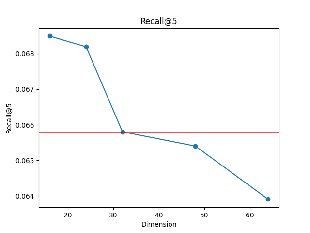
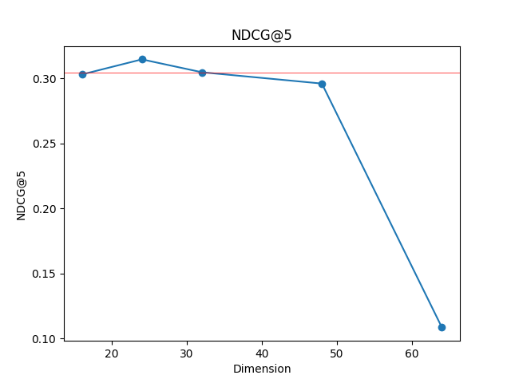
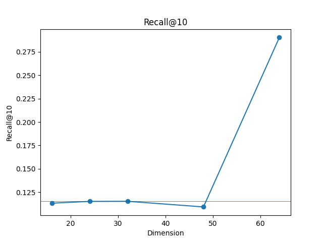
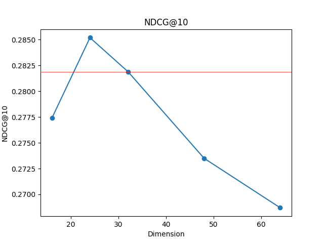
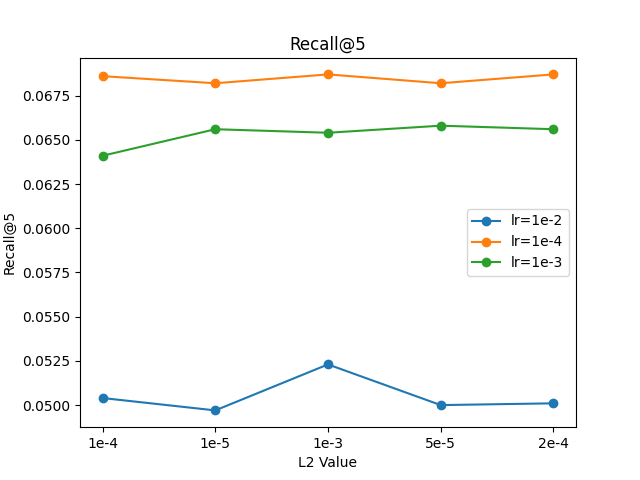
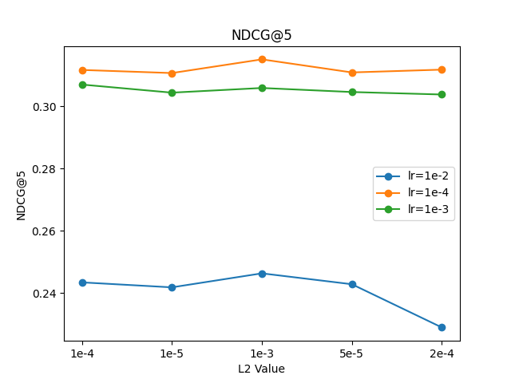
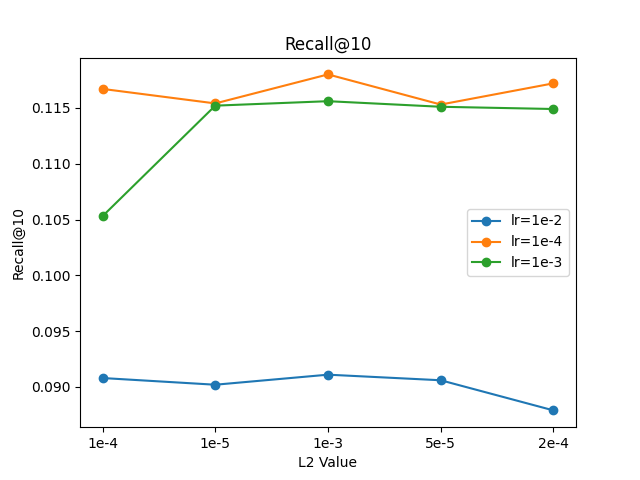
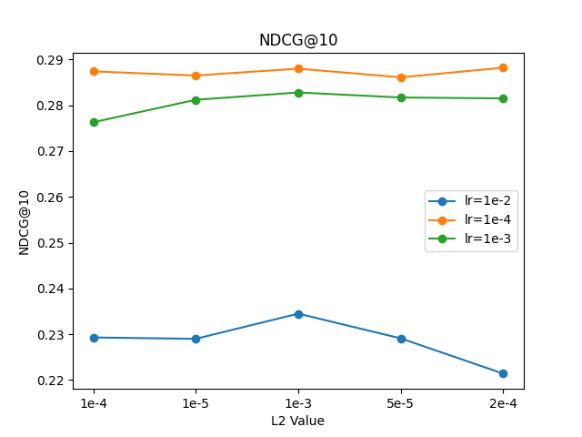
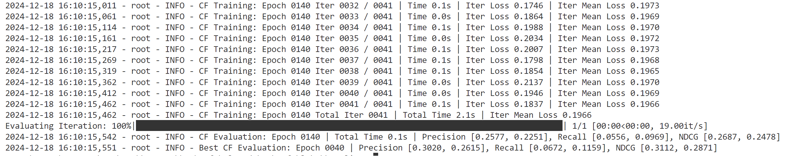

# <center>Web信息处理与应用 实验一</center>

## 实验简介

​	从公开图谱中匹配指定电影对应的实体，并抽取合适的知识图谱子图，按照规则对抽取到的图谱进行处理；进而，基于对实验一中的豆瓣电影评分数据，结合上述所抽取的图谱信息，进行可解释的、知识感知的个性化电影推荐。

### 实验环境

+ System：Win 11
+ 开发工具：Vscode，Pycharm community
+ 编程语言：python
+ 编程环境：Anaconda
+ Repository：[Github仓库](https://github.com/Mamya22/WebInfo.git)

### 实验成员

+ 组长：方馨   PB22111656
+ 组员：马筱雅 PB22111639
+ 组员：陈昕琪 PB22111711

## 实验内容


### 1. 根据实验一中提供的电影 ID 列表，匹配获得 Freebase 中对应的实体

### 2. 以 578 个可匹配实体为起点，通过三元组关联，提取一跳可达的全部实体，以形成新的起点集合。


### 3. 将电影实体ID映射到指定范围

### 4. 不同的设计的图谱嵌入方法对知识感知推荐性能的影响

#### 数据加载部分核心代码

+ 添加逆向三元组
  + 通过`max(kg_data['r']) + 1`获取`relation`的数量
  + 创建新`DataFrame`，交换三元组中的头实体（`h`）和尾实体（`t`）。
  + 更新关系索引，将其加上 `n_relations`，形成新的关系。
  + 最后，将原始三元组和逆向三元组拼接，保存在 `self.kg_data` 中。
+ 计算关系数，实体数和三元组的数量
  + 计算总的关系数 `n_relations`。
  + 计算所有实体和关系的唯一数量 `n_entities`。
  + 计算三元组的数量 `n_kg_data`。
+ 构建字典
  + 使用 `defaultdict` 来初始化两个字典 `self.kg_dict` 和 `self.relation_dict`。
  + 遍历 `self.kg_data` 的每一行，分别取出头实体、关系和尾实体。
  + 在 `self.kg_dict` 中，键为头实体，值为一个包含尾实体和关系的元组列表。
  + 在 `self.relation_dict` 中，键为关系，值为一个包含头实体和尾实体的元组列表。

```python
# 1. 为KG添加逆向三元组，即对于KG中任意三元组(h, r, t)，添加逆向三元组 (t, r+n_relations, h)，
    #    并将原三元组和逆向三元组拼接为新的DataFrame，保存在 self.kg_data 中。
    # 获取relation的数量
    n_relations = max(kg_data['r']) + 1
    print("n_relations: ", n_relations)
    new_kg_data = kg_data.copy()
    # 交换h和t
    new_kg_data[['h', 't']] = new_kg_data[['t', 'h']]
    # 更新关系
    new_kg_data['r'] = new_kg_data['r'] + n_relations
    self.kg_data = pd.concat([kg_data, new_kg_data], axis=0, ignore_index=True)


    # 2. 计算关系数，实体数和三元组的数量
    self.n_relations = max(self.kg_data['r']) + 1
    self.n_entities = pd.concat([self.kg_data['h'], self.kg_data['r']]).nunique()
    self.n_kg_data = len(self.kg_data)

    # 3. 根据 self.kg_data 构建字典 self.kg_dict ，其中 key 为 h，value 为 tuple(t, r)，
    #    和字典 self.relation_dict，其中 key 为 r，value 为 tuple(h, t)。
    self.kg_dict = collections.defaultdict(list)
    self.relation_dict = collections.defaultdict(list)

    # 遍历 DataFrame 的每一行
    for _, row in self.kg_data.iterrows():
        head = row['h']
        relation = row['r']
        tail = row['t']

        # 对 self.kg_dict 进行更新
        self.kg_dict[head].append((tail, relation))

        # 对 self.relation_dict 进行更新
        self.relation_dict[relation].append((head, tail))
```

#### 模型搭建部分核心代码

+ L2范数归一化

  对关系嵌入、头实体嵌入、尾实体嵌入和负采样的尾实体嵌入进行L2范数归一化。确保所有向量的尺度相同，避免某些向量因为尺度较大而对模型产生过大的影响。

+ 计算正样本和负样本的得分

  + 计算头实体向量和关系向量的和，与尾实体向量之间的L2距离。
  + L2距离越小，表示这对实体和关系的组合越合理，越符合KG中的真实关系。
  + 最后，将距离平方作为得分。

+ 使用BPR Loss进行优化

  通过BPR损失方法，使得负样本的得分尽量大于正样本得分，再加上L2正则化，防止模型过拟合。

```python
def calc_kg_loss_TransE(self, h, r, pos_t, neg_t):
    """
    h:      (kg_batch_size)
    r:      (kg_batch_size)
    pos_t:  (kg_batch_size)
    neg_t:  (kg_batch_size)
    """
    r_embed = self.relation_embed(r)                                                # (kg_batch_size, relation_dim)

    h_embed = self.entity_embed(h)                                                  # (kg_batch_size, embed_dim)
    pos_t_embed = self.entity_embed(pos_t)                                          # (kg_batch_size, embed_dim)
    neg_t_embed = self.entity_embed(neg_t)                                          # (kg_batch_size, embed_dim)

    # 5. 对关系嵌入，头实体嵌入，尾实体嵌入，负采样的尾实体嵌入进行L2范数归一化
    r_embed = F.normalize(r_embed, p=2, dim=1)
    h_embed = F.normalize(h_embed, p=2, dim=1)
    pos_t_embed = F.normalize(pos_t_embed, p=2, dim=1)
    neg_t_embed = F.normalize(neg_t_embed, p=2, dim=1)

    # 6. 分别计算正样本三元组 (h_embed, r_embed, pos_t_embed) 和负样本三元组 (h_embed, r_embed, neg_t_embed) 的得分
    # 通过距离计算得分
    pos_score =  torch.norm(h_embed + r_embed - pos_t_embed, p=2,dim=1) ** 2                                                                 # (kg_batch_size)
    neg_score =  torch.norm(h_embed + r_embed - neg_t_embed, p=2,dim=1) ** 2                                                                # (kg_batch_size)

    # 7. 使用 BPR Loss 进行优化，尽可能使负样本的得分大于正样本的得分
    # BPR loss定义为负对数似然损失函数
    kg_loss = torch.mean(- F.logsigmoid(neg_score - pos_score))

    l2_loss = _L2_loss_mean(h_embed) + _L2_loss_mean(r_embed) + _L2_loss_mean(pos_t_embed) + _L2_loss_mean(neg_t_embed)
    loss = kg_loss + self.kg_l2loss_lambda * l2_loss
    return loss
```

### 5. 对比分析基础推荐方法和知识感知推荐的实验结果差异

#### `mf`推荐模型

使用默认参数运行`mf`推荐模型，得到的结果如下：

| Recall@5 | NDCG@5 | Recall@10 | NDCG@10 |
| -------- | ------ | --------- | ------- |
| 0.0669   | 0.3054 | 0.1130    | 0.2821  |

#### 融合了`TransE`知识嵌入的`mf`推荐模型

在添加了相关代码后，我们使用默认参数运行了模型，得到的结果如下：

+ 采用embedding相乘进行嵌入

| Recall@5 | NDCG@5 | Recall@10 | NDCG@10 |
| -------- | ------ | --------- | ------- |
| 0.0658   | 0.3047 | 0.1152    | 0.2819  |

+ 采用embedding相加进行嵌入

修改代码

```python
# 8. 为 物品嵌入 注入 实体嵌入的语义信息
# item_pos_cf_embed =       item_pos_embed * item_pos_kg_embed                                                      # (cf_batch_size, embed_dim)
# item_neg_cf_embed =           item_neg_embed * item_neg_kg_embed                                              # (cf_batch_size, embed_dim)

item_pos_cf_embed =       item_pos_embed + item_pos_kg_embed                                                      # (cf_batch_size, embed_dim)
item_neg_cf_embed =           item_neg_embed + item_neg_kg_embed
        ....
# 9. 为 物品嵌入 注入 实体嵌入的语义信息
# item_cf_embed =        item_embed * item_kg_embed   
item_cf_embed =        item_embed + item_kg_embed
```

使用默认参数运行程序，得到的结果如下：

| Recall@5 | NDCG@5 | Recall@10 | NDCG@10 |
| -------- | ------ | --------- | ------- |
| 0.0672   | 0.3144 | 0.1142    | 0.2927  |

#### 结果分析

**与基础模型结果比较**：
相较于基础模型，可以看到嵌入了知识图谱的模型结果并没有大幅提升，通过相乘嵌入的模型甚至低于基础模型，分析如下：

+ 可能是因为相加和相乘嵌入融合的方法较为简单，不足以捕捉到知识图谱中的复杂关系。而基础模型可能已经足够复杂，可以捕捉到大部分有效信息。简单的嵌入方法可能无法显著超越基础模型
+ 也可能因为数据量不足，知识图谱中没有包含太多可以让模型学习的东西，即使使用嵌入式的方法，也无法带来明显的性能提升
+ 还可能因为使用的嵌入式方法不够精细，嵌入方法需要精细的超参数调优来发挥其最佳效果。参数没有调试好可能限制性能提升

**不同融合方式比较**：
对于相加相乘嵌入的比较，猜测出现该结果的原因可能如下：

+ 某些情况下，直接相乘可能导致嵌入的维度在某些轴上的数值变得非常大或非常小，进而影响模型的表现。而相加更能保留原始嵌入的尺度和方向，通常更加稳定。
+ 乘法可能会导致部分信息被削弱或忽略，特别是如果两个向量在同一维度上有小值的话，这些维度的信息会被进一步减弱。加法是一种线性变换，更能完整地保留两个嵌入向量的特征，并且在大多数情况下更容易被模型处理。

#### 修改参数

##### 修改`dim`

仍旧采用embedding相乘进行嵌入的方法，在原来代码的基础上，我们对参数进行修改，首先修改`embed_dim`和`relation_dim`，并使用测试脚本运行程序，且保证程序其他参数不变：

```bat
@echo off
setlocal EnableDelayedExpansion

for %%d in (16 24 32 48 64) do (
    python main_Embedding_based.py --seed 2024 ^
                                   --use_pretrain 0 ^
                                   --pretrain_model_path "trained_model/Douban/Embedding_based.pth" ^
                                   --cf_batch_size 1024 ^
                                   --kg_batch_size 2048 ^
                                   --test_batch_size 2048 ^
                                   --embed_dim %%d ^
                                   --relation_dim %%d ^
                                   --KG_embedding_type "TransE" ^
                                   --kg_l2loss_lambda 1e-4 ^
                                   --cf_l2loss_lambda 1e-4 ^
                                   --lr 1e-3 ^
                                   --n_epoch 1000 ^
                                   --stopping_steps 10
)

endlocal
```

得到的结果如下

| dim | Recall@5 | NDCG@5 | Recall@10 | NDCG@10 |
| --- | -------- | ------ | --------- | ------- |
| 16  | 0.0685   | 0.3030 | 0.1132    | 0.2774  |
| 24  | 0.0682   | 0.3146 | 0.1151    | 0.2852  |
| 32  | 0.0658   | 0.3047 | 0.1152    | 0.2819  |
| 48  | 0.0654   | 0.2960 | 0.1092    | 0.2735  |
| 64  | 0.0639   | 0.1085 | 0.2904    | 0.2687  |

将结果可视化图像如下:
<table>
    <tr>
        <td ><center></center></td>
        <td ><center></center></td>
    </tr>

    <tr>
        <td><center></center></td>
        <td ><center></center> </td>
    </tr>
</table>

<!-- 


 -->

###### 结果分析

+ `Recall@5`

  随着维度增加，逐渐下降，较小的维度可能更适合捕捉高频特征，能够推荐出更多用户感兴趣的项。当维度增加时，模型可能开始捕捉到更多复杂特征，导致高频特征的信息被部分稀释，因而 Recall@5 略微下降。维度继续增大时，高维度可能导致过拟合，使得性能进一步下降。

+ `NDCG@5`

  中等维度（例如24）时，模型能够较好地平衡复杂性和泛化能力，使推荐结果排序更合理。较小的维度可能不足以捕捉复杂关系，而较大的维度可能引入过拟合，导致排序性能下降。

+ `Recall@10`

  在维度较小时比较稳定，维度为64时有显著的提高，Recall@10 评价的是前10个推荐结果中的相关项比例。较大的维度可以捕捉更多特征，使得前10个推荐结果的覆盖面更广，从而 Recall@10 提高。

+ `NDCG@10`

  在维度24时达到峰值，然后下降，中等维度时，模型能够较好地排序推荐结果。随着维度增加，可能会过拟合，导致排序效果变差。

进而可以分析`dim`参数对模型结果的影响

+ 增加维度可以增加模型容量，使其能够捕捉更多的复杂关系。过大的维度可能导致过拟合，特别是在训练数据有限的情况下。
+ 但是较小维度也可能导致模型欠拟合，无法捕捉数据中的复杂关系。
+ 不同的维度设置会影响信息融合的效果。较小的维度更适合捕捉高频特征，而较大的维度可以捕捉更多低频特征。

综上，选择适当的维度是一个平衡过程，需要根据具体的数据集和任务进行调整和优化，以在模型复杂性和性能之间找到最佳平衡点。

##### 修改`lr`，`kg_l2loss_lambda`，`cf_l2loss_lambda`

同样，仍旧采用embedding相乘进行嵌入的方法，在原来代码的基础上，我们修改`lr`，`kg_l2loss_lambda`，`cf_l2loss_lambda`，使用测试脚本运行程序，且保证程序其他参数不变（`dim`使用默认参数）

```bat
@echo off
setlocal EnableDelayedExpansion

set lr_list=0.01 0.0001 0.001
set l2_list=0.0001 0.00001 0.001 0.00005 0.0002

for %%a in (%lr_list%) do (
    for %%b in (%l2_list%) do (
        python main_Embedding_based.py --seed 2024 ^
                                       --use_pretrain 0 ^
                                       --pretrain_model_path "trained_model/Douban/Embedding_based.pth" ^
                                       --cf_batch_size 1024 ^
                                       --kg_batch_size 2048 ^
                                       --test_batch_size 2048 ^
                                       --embed_dim 32 ^
                                       --relation_dim 32 ^
                                       --KG_embedding_type "TransE" ^
                                       --kg_l2loss_lambda %%b ^
                                       --cf_l2loss_lambda %%b ^
                                       --lr %%a ^
                                       --n_epoch 1000 ^
                                       --stopping_steps 10
    )
)

endlocal
```

得到的结果如下

| lr   | l2   | Recall@5 | NDCG@5 | Recall@10 | NDCG@10 |
| ---- | ---- | -------- | ------ | --------- | ------- |
| 1e-2 | 1e-4 | 0.0504   | 0.2434 | 0.0908    | 0.2293  |
| 1e-2 | 1e-5 | 0.0497   | 0.2418 | 0.0902    | 0.2290  |
| 1e-2 | 1e-3 | 0.0523   | 0.2463 | 0.0911    | 0.2345  |
| 1e-2 | 5e-5 | 0.0500   | 0.2428 | 0.0906    | 0.2291  |
| 1e-2 | 2e-4 | 0.0501   | 0.2289 | 0.0879    | 0.2214  |
| 1e-4 | 1e-4 | 0.0686   | 0.3117 | 0.1167    | 0.2874  |
| 1e-4 | 1e-5 | 0.0682   | 0.3107 | 0.1154    | 0.2865  |
| 1e-4 | 1e-3 | 0.0687   | 0.3151 | 0.1180    | 0.2880  |
| 1e-4 | 5e-5 | 0.0682   | 0.3109 | 0.1153    | 0.2861  |
| 1e-4 | 2e-4 | 0.0687   | 0.3118 | 0.1172    | 0.2882  |
| 1e-3 | 1e-4 | 0.0641   | 0.3070 | 0.1053    | 0.2763  |
| 1e-3 | 1e-5 | 0.0656   | 0.3044 | 0.1152    | 0.2812  |
| 1e-3 | 1e-3 | 0.0654   | 0.3059 | 0.1156    | 0.2828  |
| 1e-3 | 5e-5 | 0.0658   | 0.3046 | 0.1151    | 0.2817  |
| 1e-3 | 2e-4 | 0.0656   | 0.3038 | 0.1149    | 0.2815  |

将结果可视化图像如下:
<table>
    <tr>
        <td ><center></center></td>
        <td ><center></center></td>
    </tr>

    <tr>
        <td><center></center></td>
        <td ><center></center> </td>
    </tr>
</table>

<!--


-->

###### 结果分析

+ 正则化参数`kg_l2loss_lambda` 和 `cf_l2loss_lambda`

  + **较大的正则化参数（例如1e-3）**：

    - 意味着更强的惩罚作用，可以有效防止过拟合，但同时也可能导致欠拟合，也就是说模型无法充分学习训练数据中的复杂关系。

    - 数据中显示，对于 `1e-2` 的学习率，`1e-3` 的正则化参数提供了相对更好的结果（例如 Recall@5 为 0.0523）。

    - 对于 `1e-4` 的学习率，正则化参数为 `1e-3` 时，模型性能最好（Recall@5 为 0.0687，NDCG@5 为 0.3151）。

  + **较小的正则化参数（例如1e-5）**：

    - 更弱的惩罚作用，可能导致过拟合，即模型在训练数据上表现很好，但在测试数据上表现不好。

    - 从数据中可以看出，当正则化参数较小时，性能略微降低。例如，`1e-2` 的学习率和 `1e-5` 的正则化参数的 Recall@5 为 0.0497。

+ 学习率`lr`

  学习率决定了模型在每次迭代中更新参数的步长。

  + **较高的学习率（例如1e-2）**：

    - 模型参数更新速度快，可能更快地收敛到局部最优解，但也可能因为步长过大而错过全局最优解或导致训练不稳定。

    - 数据中显示，高学习率（1e-2）时，Recall@5 和 NDCG@5 效果较差。

  + **较低的学习率（例如1e-4）**：

    - 模型参数更新速度慢，收敛速度较慢，但有助于找到更好的全局最优解。

    - 数据中，较低学习率（1e-4）时，整体性能较好。例如，Recall@5 在 0.0686 到 0.0687 之间，NDCG@5 在 0.3117 到 0.3151 之间。

  + **中等学习率（例如1e-3）**：

    - 在某些情况下，可以在收敛速度和稳定性之间取得较好的平衡。

    - 数据中，学习率为 1e-3 时的性能相对中等。例如，Recall@5 在 0.0654 到 0.0658 之间，NDCG@5 在 0.3038 到 0.3070 之间。

综合分析：

实验输出的数据较为复杂，综合分析，较低的学习率（1e-4）配合适当的正则化参数（例如 1e-3 或 2e-4）可以提供较好的性能，避免过拟合，同时确保模型充分学习训练数据中的复杂关系。中等学习率（1e-3）也可以提供较好的性能，但可能还需要仔细调节正则化参数以防止过拟合才能达到较好的效果。

### 5 选做1，使用迭代优化方式

#### 5.1 代码调整
- 增加参数`--train_mode`，以便于选择优化方式，`multi-task`为多任务优化，`iter-task`为迭代优化
- 迭代优化实现：迭代优化则需要分开计算出`kg`的损失函数和`cf`的损失函数，分别用两种方式对模型进行训练，在一次`epoch`中，两种模型交替进行，则修改训练文件，添加代码如下
```PYTHON
for epoch in range(1, args.n_epoch + 1):
            model.train()
            time1 = time()
            total_kg_loss = 0
            n_batch_kg = data.n_cf_train // data.kg_batch_size + 1
            for iter in range(1, n_batch_kg + 1):
                time2 = time()
                kg_batch_head, kg_batch_relation, kg_batch_pos_tail, kg_batch_neg_tail = data.generate_kg_batch(data.kg_dict, data.kg_batch_size, data.n_entities)
                kg_batch_head = kg_batch_head.to(device)
                kg_batch_relation = kg_batch_relation.to(device)
                kg_batch_pos_tail = kg_batch_pos_tail.to(device)
                kg_batch_neg_tail = kg_batch_neg_tail.to(device)

                kg_batch_loss = model(kg_batch_head, kg_batch_relation,kg_batch_pos_tail, kg_batch_neg_tail, is_train= True, mode='KG')
                if np.isnan(kg_batch_loss.cpu().detach().numpy()):
                    logging.info('ERROR: Epoch {:04d} Iter {:04d} / {:04d} Loss is nan.'.format(epoch, iter, n_batch_kg))
                    sys.exit()
                kg_batch_loss.backward()
                optimizer.step()
                optimizer.zero_grad()
                total_kg_loss += kg_batch_loss.item()

                if (iter % args.print_every) == 0:
                    logging.info('KG Training: Epoch {:04d} Iter {:04d} / {:04d} | Time {:.1f}s | Iter Loss {:.4f} | Iter Mean Loss {:.4f}'.format(epoch, iter, n_batch_kg, time() - time2, kg_batch_loss.item(), total_kg_loss / iter))
                
            logging.info('KG Training: Epoch {:04d} Total Iter {:04d} | Total Time {:.1f}s | Iter Mean Loss {:.4f}'.format(epoch, n_batch_kg, time() - time1, total_kg_loss / n_batch_kg))

            time3 = time()
            total_cf_loss = 0
            n_batch_cf = data.n_cf_train // data.cf_batch_size + 1

            for iter in range(1, n_batch_cf + 1):
                time4 = time()
                cf_batch_user, cf_batch_pos_item, cf_batch_neg_item = data.generate_cf_batch(data.train_user_dict, data.cf_batch_size)

                cf_batch_user = cf_batch_user.to(device)
                cf_batch_pos_item = cf_batch_pos_item.to(device)
                cf_batch_neg_item = cf_batch_neg_item.to(device)

                cf_batch_loss = model(cf_batch_user, cf_batch_pos_item, cf_batch_neg_item, is_train=True, mode='CF')

                if np.isnan(cf_batch_loss.cpu().detach().numpy()):
                    logging.info('ERROR: Epoch {:04d} Iter {:04d} / {:04d} Loss is nan.'.format(epoch, iter, n_batch_cf))
                    sys.exit()

                cf_batch_loss.backward()
                optimizer.step()
                optimizer.zero_grad()
                total_cf_loss += cf_batch_loss.item()

                if (iter % args.print_every) == 0:
                    logging.info('CF Training: Epoch {:04d} Iter {:04d} / {:04d} | Time {:.1f}s | Iter Loss {:.4f} | Iter Mean Loss {:.4f}'.format(epoch, iter, n_batch_cf, time() - time4, cf_batch_loss.item(), total_cf_loss / iter))
            
            logging.info('CF Training: Epoch {:04d} Total Iter {:04d} | Total Time {:.1f}s | Iter Mean Loss {:.4f}'.format(epoch, n_batch_cf, time() - time3, total_cf_loss / n_batch_cf))
```

采用相加的融合方式以及默认参数，运行结果如下：

| Recall@5 | NDCG@5 | Recall@10 | NDCG@10 |
| -------- | ------ | --------- | ------- |
| 0.0672   | 0.3112 | 0.1159    | 0.2871  |

- 结果分析：与多任务优化相比，并没有明显提升，其中`NDCG@10`指标甚至有轻微下降。
- 可能原因：知识图谱融合方式不合理，导致采用迭代优化也不能合理使用知识图谱中的信息，此外，迭代学习权重的设置可能导致不能有效地结合不同任务之间的关联，从而泛化能力可能有所下降，导致`NDCG@10`指标下降。
