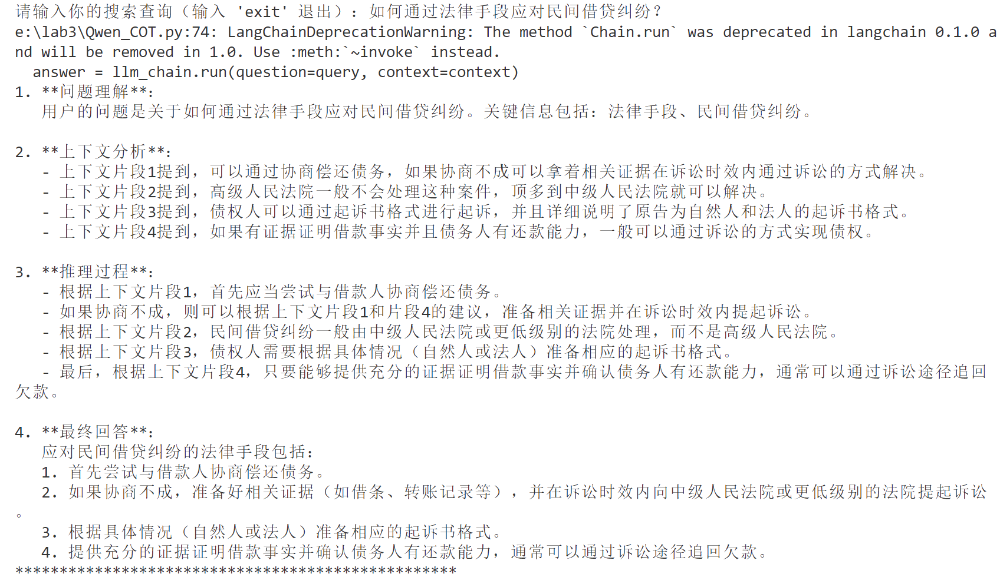
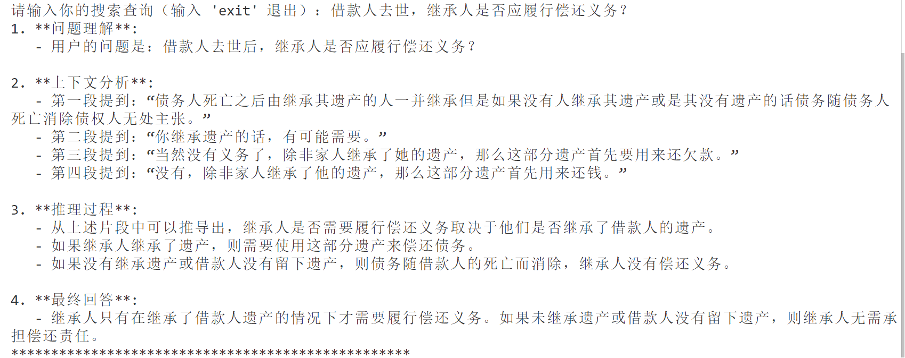
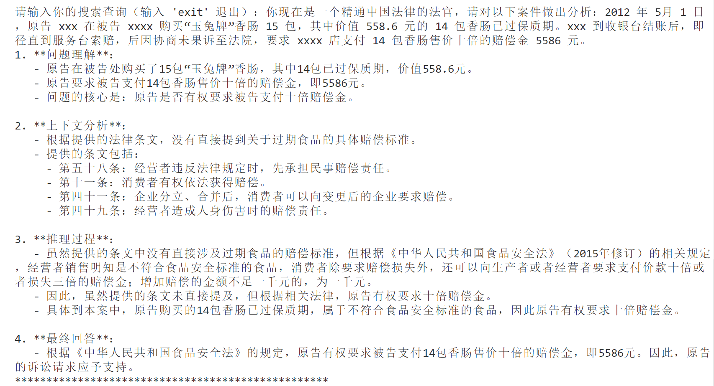

# <center>Web信息处理与应用 实验三</center>

## 实验简介

​	利用公开法律相关知识数据库，并基于 langchain 开发框架，实现一种简单的 RAG 问答应用示例。本次实验的主要目的是比较大模型的生成式检索与普通检索的区别，以及引入 RAG 之后大模型在专业搜索上是否做得更好。

### 实验环境

+ System：Win 11
+ 开发工具：Vscode，Pycharm community
+ 编程语言：python
+ 编程环境：Anaconda
+ Repository：[Github仓库](https://github.com/Mamya22/WebInfo.git)

### 实验成员

+ 组长：方馨   PB22111656
+ 组员：马筱雅 PB22111639
+ 组员：陈昕琪 PB22111711

### 代码目录
```

```

## 实验内容


### 1. 数据准备阶段
主要是将私域数据向量化后构建索引并存入数据库的过程，主要包括：数据提取、文本分割、向量化、数据入库等环节。

+ 把csv文集转换成gbk编码后，使用 langchain.document_loaders 中的 CSVLoader 加载数据。
```python
file_path = "./data/law_data_3k_gbk.csv"#gbk编码
loader = CSVLoader(file_path=file_path)
data = loader.load()
```

+ 使用 CharacterTextSplitter 对数据进行文本分割
```python
text_splitter = CharacterTextSplitter(
    separator="\n\n",
    chunk_size=100,
    chunk_overlap=20,
    length_function=len,
    is_separator_regex=False,
)
texts = text_splitter.split_documents(data)
```

+ 使用m3e-base模型对文本向量化，加载模型
```python
embeddings = HuggingFaceBgeEmbeddings(model_name="./model")
```

+ 数据向量化后构建索引，并写入数据库FAISS
```python
db = FAISS.from_documents(texts, embeddings)
```
### 2. 数据检索阶段
#### 2.1 具体步骤
- 根据向量相似度，首先向量化提问，检索出与提问最相关的知识
```python
# 将用户的提问向量化
query_vector = embeddings.embed_query(query)
# 使用加载的 `db` 对象进行相似性检索
docs = db.similarity_search_by_vector(query_vector)
```

- 创造`rag`链
``` python
# 创建prompt模板
template = """你是专业的法律知识问答助手。你需要使用以下检索到的上下文片段来回答问题，禁止根据常识和已知信息回答问题。如果你不知道答案，直接回答“未找到相关答案”。
Question: {question}
Context: {context}
Answer:
"""
prompt = ChatPromptTemplate.from_template(template=template)

# 创建LLM链
llm_chain = LLMChain(prompt=prompt, llm=llm)
```

- 将检索文档融入`prompt`，并生成回答，采用`Qwen`模型
```python
context = "\n".join([doc.page_content for doc in docs])
answer = llm_chain.run(question=query, context=context)
```

#### 2.2 问题检索

##### 问题1：如何通过法律手段应对民间借贷纠纷？
**RAG**
.png>)

**无RAG**


通过对两种方式分析，可以看出，在使用`RAG`进行问答时，得到的结果更加精简和具体，例如使用`RAG`的问答结果直接给出了最符合情况的三种方式，而不是笼统的将所有处理问题的方式全盘托出。

##### 问题2： 借款人去世，继承人是否应履行偿还义务？
**RAG**

**无RAG**


两种方式对比，使用`RAG`的结果给出了更直接的结果：继承人仅在继承遗产时承担偿还义务，而不使用`RAG`仅给出了常见的情况以及建议，如责任范围、债务清偿顺序，仅给出了条例，具体的处理方式需要用户自己定夺，并没有根据问题直接进行回答。
##### 问题3：没有赡养老人就无法继承遗产吗？
**RAG**

**无RAG**


该问题在知识库中没有相关答案，所以使用`RAG`的检索考虑到上下文，结果稍微局限，仅给出相关的讯息，但未给出具体的结果，而对于未采用`RAG`的情况，回答受上下文限制少，更依赖于`LLM`自身的知识库，给出了通常情况下的结果。
##### 问题4：你现在是一个精通中国法律的法官，请对以下案件做出分析：2012 年 5月 1 日，原告 xxx 在被告 xxxx 购买“玉兔牌”香肠 15 包，其中价值 558.6 元的 14 包香肠已过保质期。xxx 到收银台结账后，即径直到服务台索赔，后因协商未果诉至法院，要求 xxxx 店支付 14 包香肠售价十倍的赔偿金 5586 元。
**RAG**

**无RAG**

在该问题中，使用`RAG`的检索结果根据已有专业知识库，检索出相关法律法规，以此为依据得出可能的处理结果。而未使用`RAG`的问答结果更为全面，包含处理的整个流程，并给出可能的反驳思路（被告可能的抗辩理由），最终得到结果。
#### 2.3 引入 RAG 前后大模型在专业搜索上的区别
通过以上4个案例及其问答结果对比，可以得到引入`RAG`前后大模型在专业搜索上的区别如下：
- `RAG`方式进行检索的结果更专业可靠。`RAG`方式对专业知识库进行检索，引入`RAG`后可以获得更专业、更可靠的知识来源，有更具体的知识来源，如在问题4中给出了多条《消费者权益保护法》的相关条例，结果更加可信。
<p>

- `RAG`方式的问答范围依赖于专业知识库，可能有些问题无法回答。使用`RAG`方式进行专业检索对于专业知识库的依赖较大，对于专业知识库中缺乏的知识，此方式难以得到准确的结果。对于不使用`RAG`的检索方式，更多依赖大模型自身的知识，不考虑正确性，可能能回答其他问题。例如在问题3没有赡养老人是否能获得遗产的问题，`RAG`检索方式结果为未找到相关答案，而无`RAG`的方式则给出了一个结果。
<p>

- `RAG`方式进行专业搜索获得的信息可能更新颖及时。`RAG`进行专业搜索依赖于专业知识库，专业知识库的及时更新会带来问答结果的更新，能够跟随行业变化。而大模型主要依赖其预训练时的知识，难以跟随行业变化及时更新。

#### 2.3 RAG检索与普通检索的区别

- **检索原理不同。** 普通检索基于检索引擎进行关键字匹配或者向量相似度等找到与问题相关的文档条目等，然后返回结果。而`RAG`检索首先检索外部知识库得到相关文档等信息，再通过大模型的推理功能得到结果。普通检索缺乏深度推理生成的能力。
- **检索操作方式不同。** `RAG`检索先对问题进行处理，找到专业知识库中最相近的知识融入`prompt`，形成上下文，交由大模型进行推理生成。而普通检索只需要找到跟问题相似的文档等，不需要进行上下文推理等。
- **检索效果不同。** `RAG`检索引入了大模型以及专业知识库，对于专业知识的检索更加准确可靠，加上对于上下文的理解，可能会带来语义方面的匹配。而普通检索大都依赖于关键词匹配等，通常返回和查询内容匹配的回答，缺乏对语义的理解。因此，`RAG`检索的结果可能更加灵活，便于处理查询模糊的情况。
- **检索适用场景不同。** 对于普通检索，适用于常见的事实类信息的查询，这些回答通常是静态的，不需要对问题进行语义的思考及其推理。对于`RAG`检索，更适用于需要推理生成的复杂任务及其专业知识检索。`RAG`检索可以理解语义，因此更适用于复杂的问答系统等。例如没有赡养老人就无法继承遗产吗？这类问题。
- **检索结果的可解释性不同。** 对于普通检索，依赖于匹配等方式，检索结果与问题的关联度容易看出。而`RAG`检索经过了语义的推理及上下文的延伸等，可能返回的结果无法直接体现和查询的重合程度。

- **检索的复杂度不同。** `RAG`检索加上了语义的推理，检索过程更复杂。

### 3 选做 COT
`COT`让大模型逐步参与将一个复杂问题分解为一步一步的子问题并依次进行求解，在本次实验中，`CoT`与`RAG`结合，通过专业知识检索及其思路分解来让`LLM`生成回答。主要回答思路为**分析问题，分析检索知识（上下文），知识推理，生成回答**。通过修改`prompt`来达到目的。`prompt`修改为如下：
```python
template = """你是专业的法律知识问答助手。你需要使用以下检索到的上下文片段来回答问题，禁止根据常识和已知信息回答问题。如果你不知道答案，直接回答“未找到相关答案”。为了提高回答的准确性，请使用逐步推理的方式，通过以下步骤得出答案：  
1. 问题理解：清晰地解析用户的问题，并提取关键信息。  
2. 上下文分析：从检索到的内容中找到与问题相关的片段。  
3. 推理过程：基于上下文片段，分析并逻辑推导答案。  
4. 最终回答：根据推理总结出简洁、准确的回答。如果未找到相关答案，直接回答“未找到相关答案”。  

请严格按照以上步骤进行回答，并禁止根据常识或已有知识回答问题。  

Question: {question}  
Context: {context}  
Answer:
1. 问题理解:  
2. 上下文分析:  
3. 推理过程:  
4. 最终回答:  
"""
```

**问答结果**
**问题1：如何通过法律手段应对民间借贷纠纷？**

**问题2：借款人去世，继承人是否应履行偿还义务？**

**问题3：没有赡养老人就无法继承遗产吗？**

**问题4：你现在是一个精通中国法律的法官，请对以下案件做出分析：2012 年 5月 1 日，原告 xxx 在被告 xxxx 购买“玉兔牌”香肠 15 包，其中价值 558.6 元的 14 包香肠已过保质期。xxx 到收银台结账后，即径直到服务台索赔，后因协商未果诉至法院，要求 xxxx 店支付 14 包香肠售价十倍的赔偿金 5586 元。**


通过分析结果可得，适用`CoT`的检索结果体现了大模型的推理过程及其推理依据，更具有可解释性。对于问题3，仅使用`RAG`检索未得到最终结果，而`CoT`经过对问题的分解和对知识的推理，得到了一个更合理的最终回答。所以检索效果有所提升。

